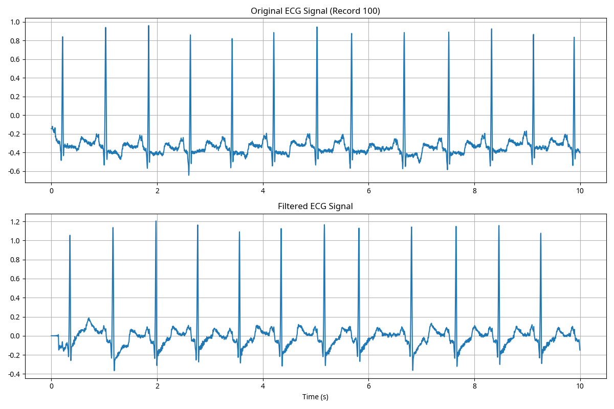
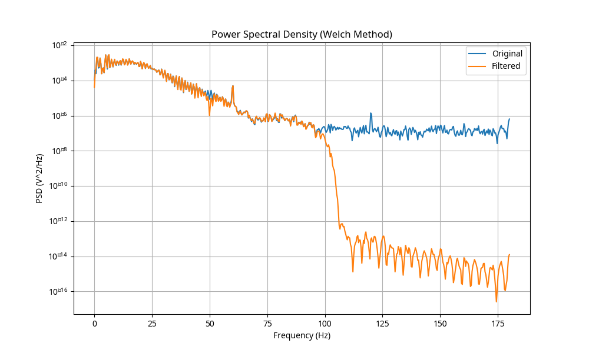
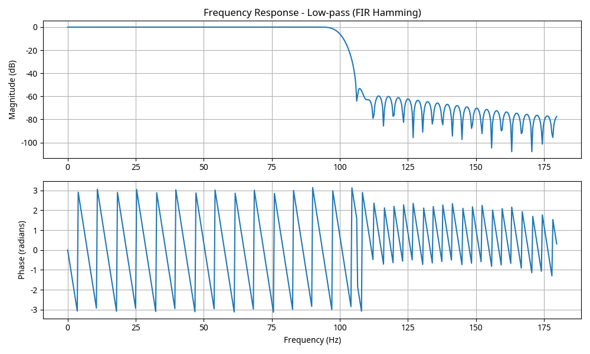
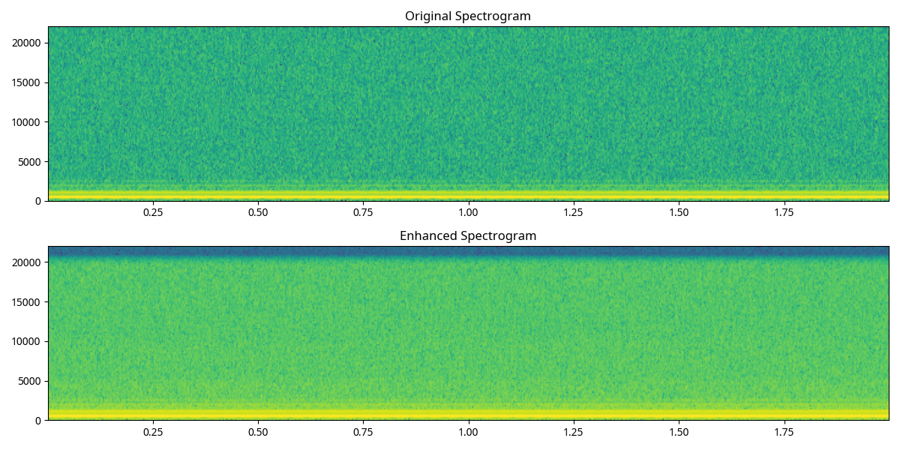
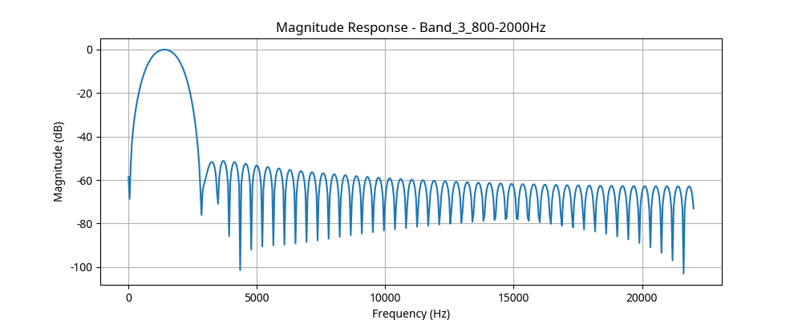

# Digital Signal Processing Final Project Report

---

## Part I: ECG Signal Denoising for Telemedicine Applications

### 1. Objective and Specifications
The objective is to design digital filters to remove noise from ECG signals (Sampling frequency: 360 Hz).

- **Baseline Wander**: < 0.5 Hz (High-pass filter required)
- **Power-line Interference**: 50 Hz (Notch filter required)
- **Muscle (EMG) Noise**: 20 - 150 Hz (Low-pass filter required)

#### Justification of Specifications
- **Passband Ripple**: < 1 dB to maintain signal integrity.
- **Stopband Attenuation**: > 40 dB to effectively suppress noise.
- **Cutoff Frequencies**: Defined by the clinical bandwidth of ECG (0.5 Hz to 100 Hz).

### 2. Filter Design and Comparison

We implemented three distinct filter types:
1. **IIR Butterworth High-pass (4th order)**: Chosen for its maximally flat passband response.
2. **IIR Notch (Q=30)**: Designed to eliminate 50 Hz noise with minimal bandwidth impact.
3. **FIR Hamming Low-pass (101 taps)**: Selected for its linear phase property, which is crucial for preserving the morphological features (P-QRS-T) of the ECG signal.

#### Filter Performance Evaluation
- **High-pass**: Successfully removes baseline drift without distorting the ST-segment.
- **Notch**: Extremely sharp rejection at 50 Hz.
- **Low-pass**: Effectively smooths the signal, removing high-frequency muscle artifacts.

### 3. Implementation Code (Python/MATLAB Equivalent)

```python
import numpy as np
from scipy import signal

def design_ecg_filters(fs=360):
    # High-pass (Baseline)
    b_hp, a_hp = signal.butter(4, 0.5, btype='highpass', fs=fs)
    # Notch (50Hz)
    b_notch, a_notch = signal.iirnotch(50, 30, fs=fs)
    # Low-pass (Muscle Noise)
    b_lp = signal.firwin(101, 100, fs=fs, window='hamming')
    return (b_hp, a_hp), (b_notch, a_notch), b_lp

# Filtering process
# sig_hp = signal.lfilter(b_hp, a_hp, raw_signal)
# sig_notch = signal.lfilter(b_notch, a_notch, sig_hp)
# sig_final = signal.lfilter(b_lp, [1.0], sig_notch)
```

### 4. Figures and Validation Results

#### ECG Signal Comparison (Record 100)

*Figure 1: Original vs. Filtered ECG Signal for Record 100.*

#### Power Spectral Density (Welch Method)

*Figure 2: Power Spectral Density showing noise reduction across frequencies.*

#### Filter Characteristics

*Figure 3: Frequency response of the 101-tap FIR Hamming Low-pass filter.*

---

## Part II: Multi-Band Speech Equalizer for Podcast Enhancement

### 1. Objective and Operation
The goal is to enhance speech clarity using a multi-band equalizer with 7 optimized bands:
- 0–100 Hz, 100–300 Hz, 300–800 Hz, 800–2 kHz, 2–5 kHz, 5–10 kHz, 10–20 kHz.

### 2. Implementation Code (Python/MATLAB Equivalent)

```python
class Equalizer:
    def design_band(self, low, high, fs, order=101):
        # FIR Bandpass design
        b = signal.firwin(order + 1, [low, high], fs=fs, pass_zero=False)
        return b

    def apply_equalization(self, data, gains_db, fs):
        output = np.zeros_like(data)
        for i, (low, high) in enumerate(bands):
            b = self.design_band(low, high, fs)
            gain = 10**(gains_db[i] / 20)
            output += gain * signal.lfilter(b, [1.0], data)
        return output
```

### 3. Performance Analysis and Discussion

#### Spectral Comparison
The spectrum after equalization shows a controlled boost in the 800 Hz - 5 kHz range, which significantly improves the "presence" and "clarity" of the human voice.

#### Spectrogram Analysis

*Figure 4: Spectrogram before and after equalization.*

#### Listening Evaluation and Trade-offs
- **Clarity**: Significant improvement in the mid-high bands (2-5 kHz) makes consonants more intelligible.
- **Artifacts**: High gains in the 10-20 kHz band can introduce "hiss" or sibilance.
- **Distortion**: Excessive boost in low bands (0-100 Hz) may cause clipping if the headroom is insufficient.
- **Trade-offs**: Increasing filter order improves band isolation but increases computational latency and potential pre-ringing in FIR filters.

### 4. Figures

#### Equalizer Band Response

*Figure 5: Frequency response for the 800Hz - 2kHz speech presence band.*

---

## Conclusion
The project successfully demonstrates the application of digital filtering in medical and audio processing. The ECG denoising pipeline provides a clean signal for diagnosis, while the speech equalizer enhances audio quality for communication.
